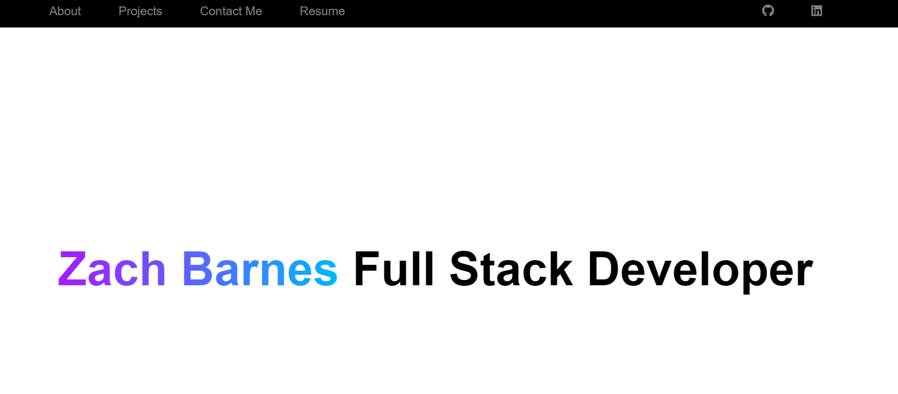

# React-portfolio

## Description

This application is a much newer version of my portfolio made with React and Vite. The portfolio is so I have a platform to get my name out there. I learned a lot of functionality of React while working on this project.

## Installation

To install my project just git clone my repository. To view it, click on the deployed application link. 

## Usage 

The portfolio has a navbar at the top of the page with links to every section. You can also just scroll down the page since everything except my resume are on the same page.

## Credits

Zach Barnes - https://github.com/TooSparky

## License

No current Licensing
